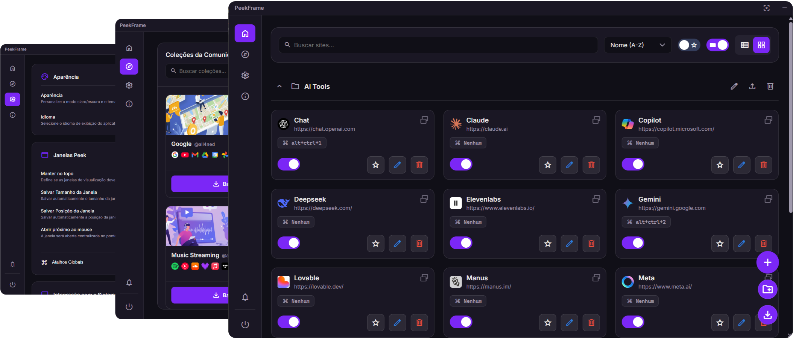

  

<h1 align="center" style="color: #9332f4; border-bottom: none; box-shadow: none; margin-bottom: 0;">
  Peek Frame
</h1>

  <i>Manage and access your websites with shortcuts simply and quickly!</i>

  

  

  

  
  
  
  
  
  
  
  
  
  
  
  
  
  
  
  
  
  
  
  
  
  

  <b>Available in 22 languages</b>

  

## 📖 About the Project

**Peek Frame** is a Windows software that lets you manage website shortcuts by opening them in floating webview windows without relying on a browser. Keep your favorite websites and services always organized and just one keystroke away.

  

## ✨ Main Features

- 🚀 **Floating Shortcuts:** Open any website as a floating, resizable window.
- 📂 **Advanced Organization:** Manage your shortcuts with folders and smart filters.
- 📦 **Community Packages:** Install collections of websites shared by the community.
- 🌙 **Themes:** Customize the interface with multiple theme options.
- 🖥️ **Tray Startup:** Automatically starts with Windows, minimized to the system tray.
- ⚙️ **Highly Configurable:** Adjust shortcuts, behavior, and appearance to suit your workflow.

## 🛠️ Technologies Used

- 🐍 **Python** – Main programming language.
- ⚗️ **Flask** – Lightweight web framework for the backend.
- 🖼️ **Jinja2** – Template engine to generate dynamic HTML.
- 💻 **HTML, CSS, and JavaScript** – User interface technologies.
- 🪟 **pywebview** – Displays the web interface as a native desktop app.
- 
## 📥 Installation

1. Go to the [Releases](https://github.com/sandroallan/peekframe/releases) page of this repository.
2. Download the latest version: **peek_frame_setup.exe**.
3. Run the installer and follow the instructions.

## 🤝 How to Contribute

Contributions make the open-source community an amazing place to learn, collaborate, and innovate. Any contributions you make are greatly appreciated.

1. Fork the project.
2. Create a branch for your feature: `git checkout -b feature/AmazingFeature`.
3. Commit your changes: `git commit -m "Add some AmazingFeature"`.
4. Push to the branch: `git push origin feature/AmazingFeature`.
5. Open a Pull Request for review.

## 📄 License

This project is licensed under the [GPL v3 License](https://www.gnu.org/licenses/gpl-3.0.html).  
See the `LICENSE` file for details.
