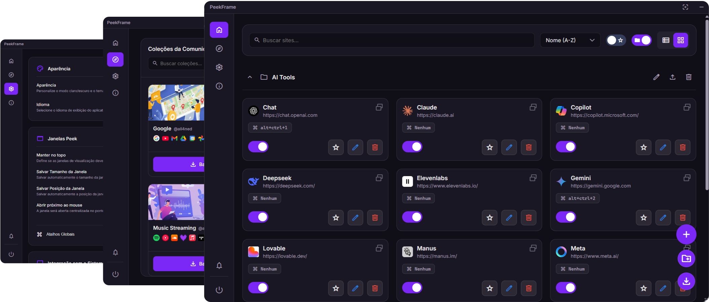

  

  

<h1 align="center" style="color: #9332f4; border-bottom: none; box-shadow: none; margin-bottom: 0;">
  Peek Frame
</h1>

  <i>Gerencie e acesse seus sites com atalhos de forma simples e rápida!</i>

  
  
  

  
  
  
  
  
  
  
  
  
  
  
  
  
  
  
  
  
  
  
  
  
  

  <b>Disponível em 22 idiomas</b>

## 📖 Sobre o Projeto

**Peek Frame** é uma aplicação para Windows desenvolvida para gerenciar atalhos de sites, abrindo-os em janelas flutuantes (webviews). Permite acesso rápido e organizado aos seus sites e serviços favoritos diretamente da área de trabalho.

Oferece recursos avançados de organização, como pastas e filtros, além de um sistema de pacotes que permite à comunidade criar e compartilhar coleções de sites, incluindo pacotes dedicados a ferramentas de IA.

## ✨ Principais Funcionalidades

- 🚀 **Atalhos Flutuantes:** Abra qualquer site em uma janela flutuante e redimensionável.
- 📂 **Organização Avançada:** Gerencie seus atalhos com pastas e filtros inteligentes.
- 📦 **Pacotes da Comunidade:** Instale coleções de sites compartilhadas pela comunidade.
- 🌙 **Temas:** Personalize a interface com várias opções de temas.
- 🖥️ **Inicialização na Bandeja:** Inicia automaticamente com o Windows, minimizado na bandeja do sistema.
- ⚙️ **Altamente Configurável:** Ajuste atalhos, comportamento e aparência para se adequar ao seu fluxo de trabalho.

## 🛠️ Tecnologias Utilizadas

- 🐍 **Python** – Linguagem principal de programação.
- ⚗️ **Flask** – Framework web leve para o backend.
- 🖼️ **Jinja2** – Motor de templates para gerar HTML dinâmico.
- 💻 **HTML, CSS e JavaScript** – Tecnologias para a interface do usuário.
- 🪟 **pywebview** – Exibe a interface web como um app desktop nativo.

## 📥 Instalação

1. Acesse a página de [Releases](https://github.com/sandroallan/peekframe/releases) deste repositório.
2. Baixe a versão mais recente: **peek_frame_setup.exe**.
3. Execute o instalador e siga as instruções.

## 🤝 Como Contribuir

Contribuições tornam a comunidade open source um lugar incrível para aprender, colaborar e inovar. Toda contribuição é muito bem-vinda.

1. Faça um fork do projeto.
2. Crie uma branch para sua feature: `git checkout -b feature/AmazingFeature`.
3. Faça commit das suas alterações: `git commit -m "Add some AmazingFeature"`.
4. Envie para a branch: `git push origin feature/AmazingFeature`.
5. Abra um Pull Request para revisão.

## 📄 Licença

Este projeto está licenciado sob a [Licença MIT](https://opensource.org/licenses/MIT).  
Veja o arquivo `LICENSE` para mais detalhes.
